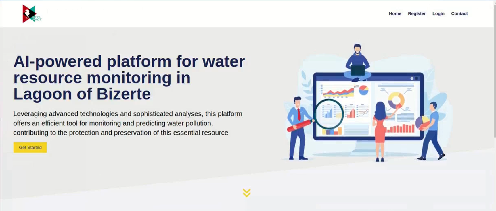
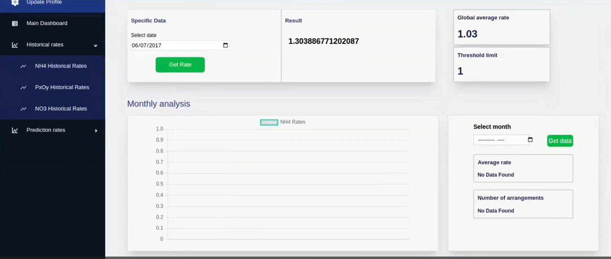
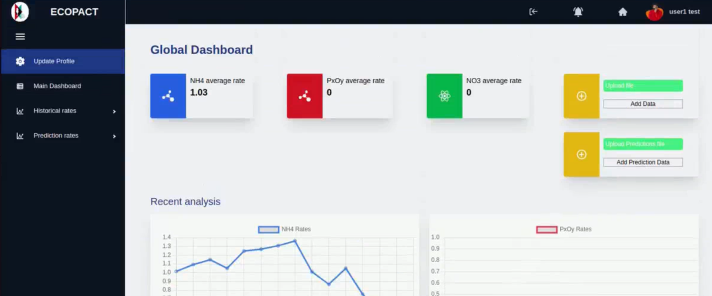
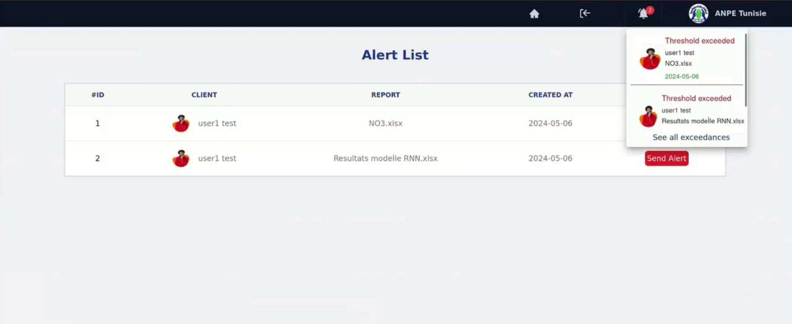
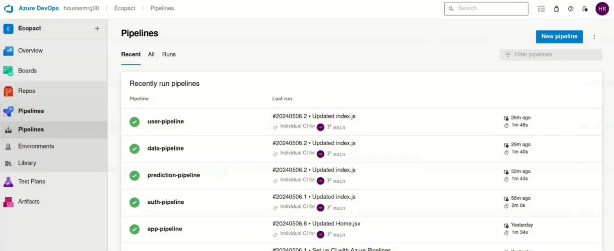

<h1>🌊 Ecopact - Water Resource Monitoring System</h1>

    <strong>Ecopact</strong> is a comprehensive monitoring system for water resources, focusing on the eutrophication phenomenon in the Bizerte Lagoon. Developed using the <strong>MERN stack</strong> and deployed on <strong>Azure Kubernetes Service (AKS)</strong> with DevOps practices, Ecopact helps in tracking, analyzing, and predicting the levels of pollutants (phosphorus, nitrate, ammonium) in water bodies, providing essential insights for environmental conservation.

<h2>🌟 Features</h2>
<ul>
    <li>📈 <strong>Real-time Monitoring</strong>: Track levels of pollutants and assess water quality dynamically.</li>
    <li>🤖 <strong>AI-based Predictions</strong>: Use machine learning models to predict pollution trends.</li>
    <li>📊 <strong>Data Visualization</strong>: Visualize historical data and predictions for actionable insights.</li>
    <li>📬 <strong>Alert System</strong>: Generate alerts for critical pollutant levels, notifying relevant stakeholders.</li>
    <li>🔐 <strong>User Authentication</strong>: Secure login for ANPE and client users to access monitoring data and settings.</li>
</ul>

<h2>🛠️ Microservices Architecture</h2>

The <strong>Ecopact</strong> application is divided into multiple microservices, each designed to handle specific functionalities and deployed independently. This modular approach ensures scalability, maintainability, and efficient resource management. Below are the key microservices:

<ul>
    <li><strong>User Service</strong>: Manages user profiles and roles, allowing the ANPE and clients to access data based on permissions.</li>
    <li><strong>Authentication Service</strong>: Responsible for user registration, login, and JWT-based authentication.</li>
    <li><strong>Data Service</strong>: Handles the storage and retrieval of water quality data, including pollutant concentrations and other environmental metrics.</li>
    <li><strong>Prediction Service</strong>: Uses machine learning models to predict future pollutant levels based on historical data, supporting proactive water management.</li>
    <li><strong>Alerts Service</strong>: Sends notifications and alerts to users when pollutant levels exceed safe thresholds, enabling timely intervention.</li>
</ul>

<h2>📸 Screenshots</h2>

Below are screenshots showcasing the key features of <strong>Ecopact</strong>.

<h3>1. Home Page</h3>

The home page provides an overview of the application and allows users to navigate to various sections, such as monitoring, statistics, and alerts.

<h3>2. Main Dashboard</h3>

The main dashboard displays a comprehensive view of real-time water quality data, including pollutant levels and overall environmental health, with insights on trends over time.

<h3>3. Specific Item Dashboard - Monthly and Yearly Stats</h3>

This dashboard offers detailed statistics for specific pollutants, such as phosphorus or nitrate, with monthly and yearly breakdowns. Users can analyze changes over time to make informed decisions on environmental interventions.

<h3>4. Alerts and Notifications</h3>

The alerts and notifications panel shows real-time alerts for any critical pollutant levels, allowing prompt action. Users can set thresholds and receive notifications when specific conditions are met.

<h3>5. CI/CD Pipeline for Each Microservice</h3>

The CI/CD pipeline screenshot shows the automated deployment and testing setup for each microservice. This pipeline ensures efficient updates and scaling with Azure DevOps and ArgoCD, reducing manual deployment efforts and promoting a smooth development workflow.

<h2>🛠️ Technology Stack</h2>
<ul>
    <li><strong>Frontend:</strong> React.js</li>
    <li><strong>Backend:</strong> Node.js, Express.js</li>
    <li><strong>Database:</strong> MongoDB</li>
    <li><strong>Orchestration:</strong> Kubernetes (AKS)</li>
    <li><strong>CI/CD:</strong> Azure DevOps, ArgoCD</li>
</ul>

<h2>🚀 Getting Started</h2>

<h3>Prerequisites</h3>
<ul>
    <li><a href="https://nodejs.org/">Node.js</a> and <a href="https://www.mongodb.com/">MongoDB</a></li>
    <li><a href="https://azure.microsoft.com/en-us/services/kubernetes-service/">Azure Kubernetes Service (AKS)</a></li>
    <li><a href="https://azure.microsoft.com/en-us/services/devops/">Azure DevOps</a></li>
</ul>

<h3>Installation</h3>
<ol>
    <li><strong>Clone the repository:</strong></li>
    <pre><code>git clone https://github.com/HoussemRg/ECOPACT.git
cd ecopact
    </code></pre>

   <li><strong>Set up MongoDB Database:</strong> Ensure MongoDB is running locally or use a cloud database service.</li>

   <li><strong>Configure the environment variables:</strong> Create a <code>.env</code> file with the necessary configurations for MongoDB, JWT secrets, and other sensitive data.</li>

   <li><strong>Run the application:</strong> Start the backend and frontend servers.</li>
</ol>

<h2>🎯 Usage</h2>
<ol>
    <li><strong>Login</strong> with an administrator or client role.</li>
    <li><strong>Access</strong> real-time pollutant data and view predictive insights.</li>
    <li><strong>Set</strong> alerts and view historical data to monitor changes over time.</li>
</ol>

<h2>🤝 Contributing</h2>

Contributions are welcome! Follow these steps:

<ol>
    <li>Fork the repository.</li>
    <li>Create a new branch (<code>git checkout -b feature/new-feature</code>).</li>
    <li>Commit your changes (<code>git commit -m 'Add new feature'</code>).</li>
    <li>Push to the branch (<code>git push origin feature/new-feature</code>).</li>
    <li>Open a Pull Request.</li>
</ol>

<h2>📄 License</h2>

This project is licensed under the MIT License - see the <a href="LICENSE">LICENSE</a> file for details.

<h2>👨‍💻 Authors</h2>

<strong>Houssem Regaieg</strong>

<ul>
    <li><a href="https://www.linkedin.com/in/houssem-regaieg-589526258/">LinkedIn</a></li>
    <li><a href="https://github.com/HoussemRg">GitHub</a></li>
</ul>
